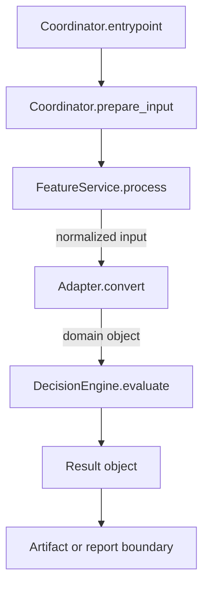

# Feature Docs Confluence

Use this skill when creating a concise Confluence-ready architecture document
for a codebase feature.

## Workflow

1. Explore the relevant code and docs first.
2. Identify the feature entrypoint, coordinator, main components, important
   data objects, and output/report boundary.
3. Create a short English Markdown document under `agent_docs/`.
4. Put the Mermaid data-flow diagram at the beginning of `High-Level Behavior`.
5. Generate a PNG export of the Mermaid diagram next to the Markdown file.
6. Self-review for accuracy, scope, and stale claims.
7. Run repository-required validation commands.
8. Report the Markdown path, PNG path, and verification results.

## Document Structure

Use these sections:

- `# <Feature Name> - Feature Architecture`
- `## Feature Goal`
- `## High-Level Behavior`
- `## Main Components`
- `## Decision Heuristics`
- `## Report / Output Behavior`

Do not include sections such as `Current non-goals`, `Resource handling notes`,
`Failure model`, `Input / output`, or `Technologies` unless the user explicitly
requests them.

## High-Level Behavior

Start this section with the Mermaid diagram, then add concise bullets.

The diagram should show data moving through classes, methods, functions, and
output/report boundaries. It should not be a pure decision-flow chart.

Omit tiny helper functions when they add noise. Move small implementation
details onto arrow labels.

## Mermaid Diagram Pattern



## PNG Export

Generate a PNG for the Mermaid diagram.

Prefer `mmdc` when available:

```bash
mmdc -i /tmp/feature-diagram.mmd -o agent_docs/NN-feature-name-data-flow.png -b transparent
```

Otherwise use:

```bash
npx --yes @mermaid-js/mermaid-cli \
  -i /tmp/feature-diagram.mmd \
  -o agent_docs/NN-feature-name-data-flow.png \
  -b transparent
```

Extract the Mermaid block from the Markdown document:

```bash
sed -n '/```mermaid/,/```/p' agent_docs/NN-feature-name-architecture.md | sed '1d;$d' > /tmp/feature-diagram.mmd
```

Verify the PNG output:

```bash
file agent_docs/NN-feature-name-data-flow.png
ls -lh agent_docs/NN-feature-name-data-flow.png
```

## Style Rules

- Write in English.
- Keep it concise and Confluence-ready.
- Document current behavior only.
- Do not invent calibration sources or planned behavior.
- Prefer component-level descriptions over implementation walkthroughs.
- Keep paragraphs short.
- Use tables for component responsibilities.
- Include only meaningful outputs/report behavior.

## Validation

Run the repository-required checks. In this repo, run:

```bash
make lint
make test
```

Report the results honestly.
